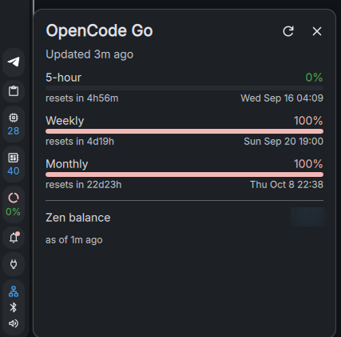

# OpenCode Go Usage

A [DankMaterialShell](https://github.com/AvengeMedia/DankMaterialShell) bar widget that shows your [OpenCode](https://opencode.ai) Go usage windows (5-hour, weekly, monthly) with reset countdowns, plus your optional Zen balance.



## Features

- **Bar pill** showing `5h 34% · wk 42% · mo 18%`, color-coded by the worst window (green → amber → red)
- **Popout** with per-window progress bars, reset countdowns, absolute reset times, and last-update age
- **Zen balance** row (optional) pulled from your `opencode.ai` dashboard
- **Cached & polite** — respects a cache TTL, backs off after failures, and retains the last good value when a refresh fails (dimmed with a `⚠` marker)
- Reads the API key automatically from `~/.local/share/opencode/auth.json` — no credentials in the plugin

## Installation

### From the registry

```sh
dms plugins install opencode-go-usage
```

Then enable it in **Settings → Plugins** and add it to your bar layout.

### Manually

```sh
mkdir -p ~/.config/DankMaterialShell/plugins
git clone https://github.com/Coleej/Opencode-go-usage ~/.config/DankMaterialShell/plugins/opencode-go-usage
dms restart
```

Enable it in **Settings → Plugins**, then add **OpenCode Go Usage** to the bar.

## Requirements

- DMS ≥ 1.5.0
- `curl` and `jq` on `PATH`
- An OpenCode Go API key in `~/.local/share/opencode/auth.json` (written automatically by the OpenCode CLI / console login)

## Configuration

| Setting | Default | Description |
| --- | --- | --- |
| Refresh interval | 120 s | How often usage is fetched (30–600 s) |
| Show 5h reset countdown in bar | off | Append `↻4h30m` to the pill |
| Zen auth cookie | *(empty)* | Enables the balance row (see below) |
| Workspace ID | *(empty)* | `wrk_…` from your workspace URL; skips auto-discovery |
| Helper script path | *(empty)* | Override if the plugin lives somewhere else |

### Zen balance (optional)

The balance comes from the `opencode.ai` dashboard, which requires a browser session. To enable it:

1. Log in to <https://opencode.ai>
2. In your browser devtools, copy the value of the `auth` cookie for `opencode.ai` (Application → Cookies)
3. Paste it into the **Zen auth cookie** setting

The cookie is a **secret** and is stored only in your local DMS plugin settings. It expires periodically (opencode.ai rotates its session secret) — when the balance shows "cookie expired", re-paste a fresh one.

## How it works

The widget shells out to [`opencode-go-usage.sh`](opencode-go-usage.sh), which:

- Fetches usage windows from the official API at `https://opencode.ai/zen/go/v1/usage` (Bearer auth)
- Optionally scrapes the Zen balance from `https://opencode.ai/workspace/<id>`, falling back to the console's billing server function
- Caches results under `~/.cache/opencode-go-usage/` and prints a single JSON envelope that the widget renders

All error state is carried in the JSON envelope — the script always exits cleanly so the widget can degrade gracefully.

## Development

The fetch logic has an offline test suite (no network, no real credentials required):

```sh
tests/run_tests.sh
```

It runs fixture-backed checks plus a live test against the real API when `~/.local/share/opencode/auth.json` is present (skip with `SKIP_LIVE=1`).

## Publishing

The registry manifest for the [dms-plugin-registry](https://github.com/AvengeMedia/dms-plugin-registry) lives at [`docs/registry/coleej-opencode-go-usage.json`](docs/registry/coleej-opencode-go-usage.json). To publish, push this repo to GitHub, add a real `assets/screenshot.png`, then open a PR to the registry that adds that manifest file.

## License

[MIT](LICENSE)
